# MANUAL DE ADMINISTRADOR — FILMATE

**Panel de gestión administrativa para cartelera, cines, salas, programación y ventas**

| Campo | Información |
|---|---|
| Código del documento | MA-FILMATE-ADM-001 |
| Versión | 1.0 |
| Línea base documental | 20 de junio de 2026 |
| Curso | Gestión de la Configuración de Software |
| Tipo de entregable | Manual de administrador con evidencia visual |
| Estado | Versión para evaluación académica |
| Elaborado por | Equipo FILMATE |
| Docente | REYES HUAMAN, ANITA MARLENE |

> Este documento describe el frontend administrativo de FILMATE y sus flujos integrados.

# Control del documento

| Versión | Fecha | Descripción del cambio | Responsable |
|---|---|---|---|
| 0.1 | 20/06/2026 | Inventario funcional y planificación de capturas. | Equipo FILMATE |
| 0.9 | 20/06/2026 | Ejecución de 26 evidencias visuales y validación de flujos. | Equipo FILMATE |
| 1.0 | 20/06/2026 | Emisión del manual académico en Markdown, Word y PDF. | Equipo FILMATE |

> Criterio de configuración documental: este manual se identifica mediante el código MA-FILMATE-ADM-001; la versión 1.0 queda asociada a la línea base visual del 20 de junio de 2026. Cualquier cambio en rutas, etiquetas, reglas de validación, flujos de administración o diseño de pantallas debe originar una nueva revisión del documento y la sustitución de las capturas afectadas.

# Contenido

- 1. Introducción, objetivo y alcance.
- 2. Descripción del sistema, perfiles y requisitos de uso.
- 3. Convenciones visuales y mapa de navegación.
- 4. Acceso e inicio de sesión.
- 5. Barra lateral y navegación.
- 6. Dashboard principal: estadísticas y gráficos.
- 7. Dashboard principal: últimas transacciones.
- 8. Catálogo de películas.
- 9. Cines y salas (CRUD).
- 10. Programación y funciones.
- 11. Ventas y tickets.
- 12. Reembolsos y devoluciones.
- 13. Validación de entrada.
- 14. Ayuda y soporte.
- 15. Cierre de sesión.
- 16. Solución de problemas.
- 17. Seguridad, privacidad y buenas prácticas.
- 18. Trazabilidad, criterios de aceptación y gestión del manual.
- 19. Glosario y guía rápida.

# 1. Introducción

## 1.1 Objetivo

Orientar al administrador en el uso seguro y correcto del panel de gestión FILMATE, desde el acceso inicial hasta la administración de películas, cines, salas, programación, ventas, reembolsos y soporte. Cada procedimiento incluye precondiciones, acciones, resultado esperado y evidencia visual.

## 1.2 Alcance

El manual cubre el frontend administrativo: inicio de sesión, dashboard con estadísticas y gráficos, catálogo de películas con filtros, gestión de cines y salas (CRUD), programación de funciones, ventas y tickets con filtros y detalle, flujo completo de reembolsos (solicitud, revisión, resolución), validación de entrada y módulo de ayuda y soporte.

No cubre el frontend de usuario (cartelera pública, reserva, dulcería, perfil social) ni la configuración interna del servidor, base de datos o infraestructura; esas operaciones corresponden al equipo de desarrollo.

## 1.3 Base de la evidencia

Las capturas se obtuvieron el 20 de junio de 2026 sobre la aplicación React/Vite del repositorio FILMATE_AdminFrontend. Se utilizó un entorno de demostración local controlado con la misma estructura de datos y contratos de API. No se utilizaron datos financieros reales.

# 2. Descripción general del sistema

FILMATE Admin es un panel de gestión web orientado al personal administrativo de cines. Integra la administración de películas, locales, salas, horarios, ventas y soporte al cliente.

## 2.1 Perfiles de acceso

| Perfil | Capacidades principales | Restricciones |
|---|---|---|
| Administrador | Gestión completa: catálogos, programación, ventas, reembolsos y soporte. | Debe iniciar sesión con credenciales administrativas. |
| Validador | Validar entradas en punto de atención. | No accede a catálogos, ventas ni reembolsos. |

## 2.2 Requisitos mínimos

- Equipo de escritorio, portátil o tableta con navegador moderno.
- Google Chrome, Microsoft Edge o Mozilla Firefox actualizado.
- Resolución recomendada de escritorio: 1366 × 768 o superior.
- Conexión de red estable con acceso al frontend y al servicio API.
- Credenciales de administrador proporcionadas por el área de TI.
- JavaScript y almacenamiento local habilitados en el navegador.

# 3. Convenciones y navegación

## 3.1 Convenciones visuales

| Elemento | Significado |
|---|---|
| Botón rojo | Acción destructiva (eliminar, cancelar) o cierre de sesión. |
| Botón azul | Acción de navegación, edición o consulta. |
| Botón verde | Confirmación o creación de recurso. |
| Mensaje rojo | Error de validación o imposibilidad de completar una operación. |
| Mensaje verde | Operación completada correctamente. |
| Panel lateral | Navegación entre módulos del sistema. |

## 3.2 Mapa de navegación

La barra lateral izquierda permite navegar entre los módulos: Dashboard, Catálogo, Cines y Salas, Programación, Ventas y Tickets, Validación de Entrada y Ayuda/Soporte.

> Dashboard → Catálogo → Cines y Salas → Programación → Ventas → Validación → Ayuda.

# 4. Acceso al sistema

## 4.1 Iniciar sesión como administrador

Precondición: el administrador debe disponer de una cuenta activa con rol administrativo.

1. Abra la URL del panel administrativo en el navegador.
2. Escriba el correo electrónico registrado.
3. Escriba la contraseña; el valor se oculta por seguridad.
4. Seleccione «Iniciar sesión» o presione Enter.
5. Espere el mensaje de éxito y la redirección automática al Dashboard.

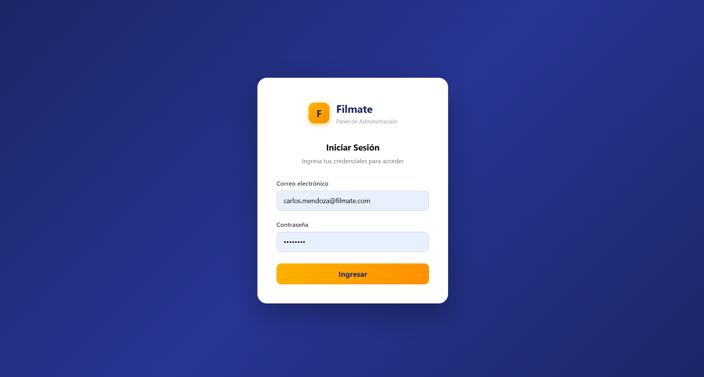

*Figura 1. Pantalla de inicio de sesión del panel administrativo.*

Elementos y lectura de la pantalla:

- El campo de correo exige un formato que incluya el carácter @.
- La contraseña se muestra en modo oculto.
- Las credenciales deben corresponder a un perfil administrativo.

## 4.2 Validaciones de acceso

Si falta un dato, el correo no tiene formato válido o las credenciales no coinciden, FILMATE presenta un mensaje de error. Corrija el dato indicado y vuelva a intentar.

# 5. Barra lateral y navegación

## 5.1 Estructura de la barra lateral

Una vez dentro del panel, la barra lateral izquierda agrupa el acceso a todos los módulos administrativos. El módulo activo se resalta visualmente.

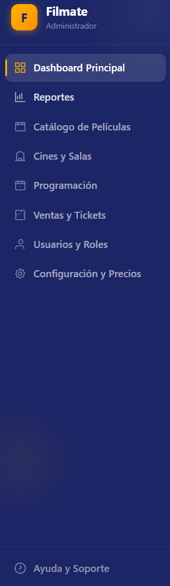

*Figura 2. Barra lateral con todos los módulos administrativos.*

Elementos y lectura de la pantalla:

- Dashboard: estadísticas y gráficos del negocio.
- Catálogo: gestión de películas.
- Cines y Salas: administración de locales y salas.
- Programación: asignación de funciones.
- Ventas y Tickets: consulta y gestión de transacciones.
- Validación de Entrada: escaneo de tickets.
- Ayuda y Soporte: gestión de consultas.

## 5.2 Cerrar sesión desde la barra

1. Ubique el botón de cerrar sesión al final de la barra lateral.
2. Selecciónelo y confirme la acción en el diálogo emergente.
3. Espere la redirección a la pantalla de inicio de sesión.

# 6. Dashboard principal

## 6.1 Estadísticas y gráficos

El Dashboard presenta un resumen visual del negocio: tarjetas con métricas clave y gráficos de ingresos. El administrador puede filtrar por período (hoy, semana, mes, mes anterior).

*Figura 3. Dashboard con tarjetas de métricas y gráfico de ingresos por categoría.*

Elementos y lectura de la pantalla:

- Tarjetas superiores: total de transacciones, ingresos totales, productos más vendidos.
- Selector de período (hoy, semana, mes, mes anterior) para filtrar datos.
- Gráfico circular de ingresos por categoría.
- Gráfico de barras para comparativas de rendimiento.

## 6.2 Últimas transacciones

Debajo de los gráficos, una tabla muestra las transacciones más recientes registradas en el sistema.

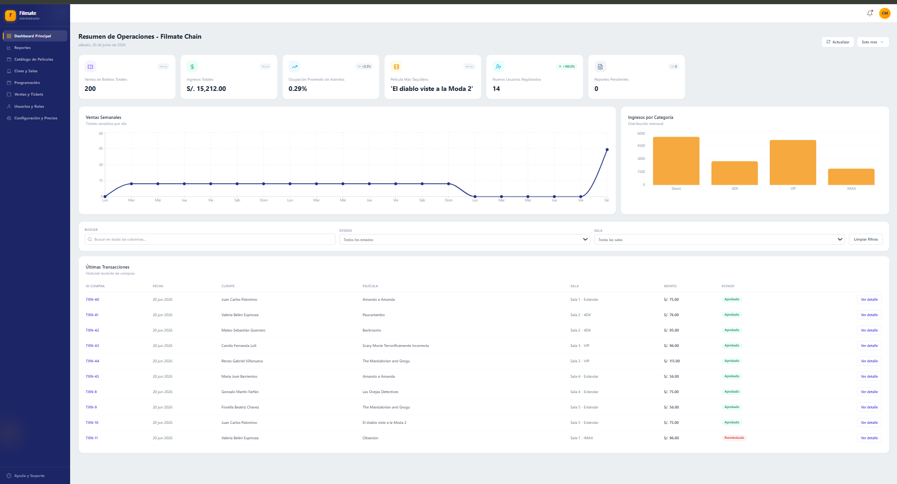

*Figura 4. Tabla de últimas transacciones en el Dashboard.*

Elementos y lectura de la pantalla:

- Columnas: ID, usuario, película, fecha, monto, estado.
- La tabla se actualiza automáticamente al cambiar el filtro de período.
- Seleccione una fila para ver el detalle completo de la transacción.

# 7. Catálogo de películas

## 7.1 Vista general del catálogo

El módulo de Catálogo lista todas las películas registradas en el sistema. Cada película muestra póster, título, género, clasificación y estado.

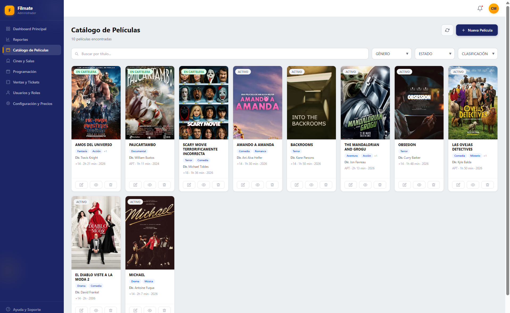

*Figura 5. Listado general del catálogo de películas.*

Elementos y lectura de la pantalla:

- Cada tarjeta incluye póster, título, género, duración, clasificación y estado.
- Botones de acción: editar y eliminar por película.
- Botón «Agregar Película» para incorporar nuevos títulos.

## 7.2 Filtros del catálogo

1. Use el campo de búsqueda para encontrar películas por título.
2. Filtre por género, clasificación o estado (activa/inactiva).
3. Seleccione «Limpiar filtros» para restablecer la vista completa.

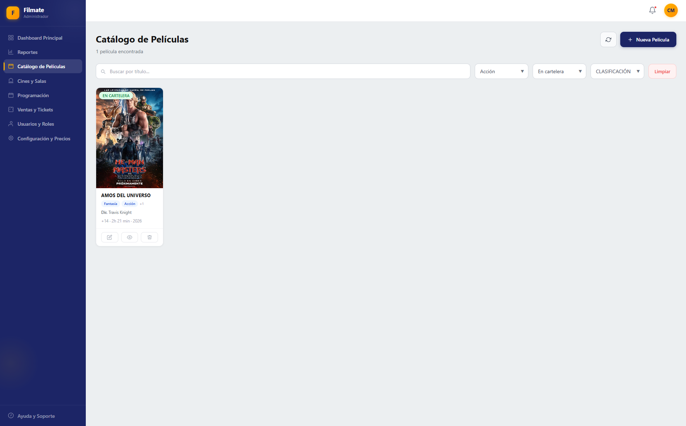

*Figura 6. Catálogo filtrado por criterios de búsqueda.*

Elementos y lectura de la pantalla:

- Los filtros se aplican en tiempo real sobre el listado.
- Combine múltiples criterios para refinar la búsqueda.
- Si no hay coincidencias, ajuste los filtros aplicados.

# 8. Cines y salas

## 8.1 Vista general de cines

El módulo de Cines y Salas permite administrar los locales y sus respectivas salas de exhibición.

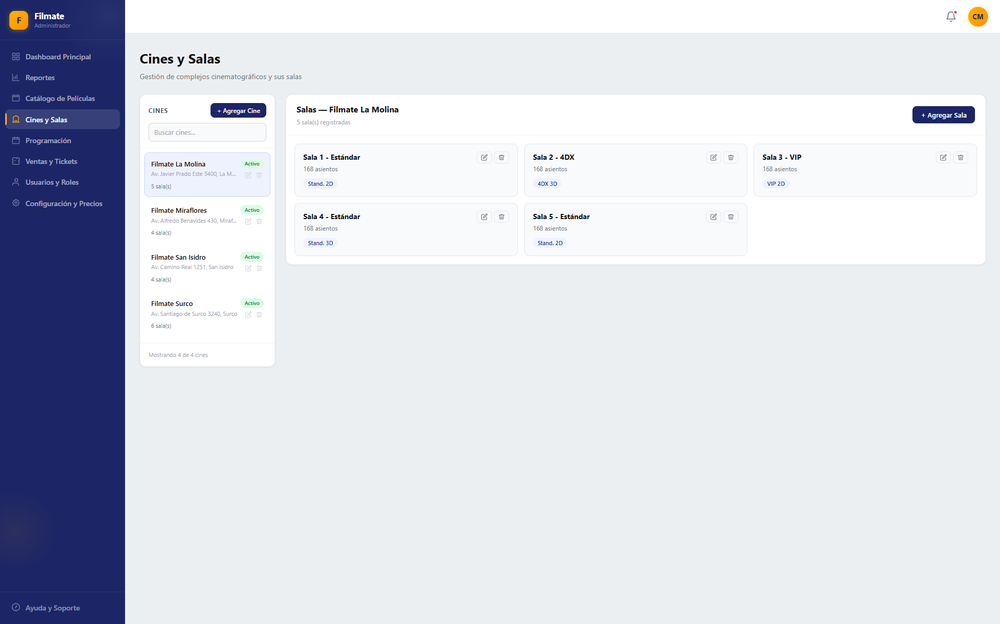

*Figura 7. Listado de cines registrados en el sistema.*

Elementos y lectura de la pantalla:

- Cada cine muestra nombre, dirección, teléfono y número de salas.
- Botones de acción: editar cine, ver salas, eliminar.
- Botón «Agregar Cine» para registrar un nuevo local.

## 8.2 Agregar un cine

1. Seleccione «Agregar Cine» en la parte superior del listado.
2. Complete el formulario: nombre, dirección, teléfono y estado.
3. Seleccione «Guardar» para registrar el nuevo cine.
4. Confirme que el cine aparece en el listado principal.

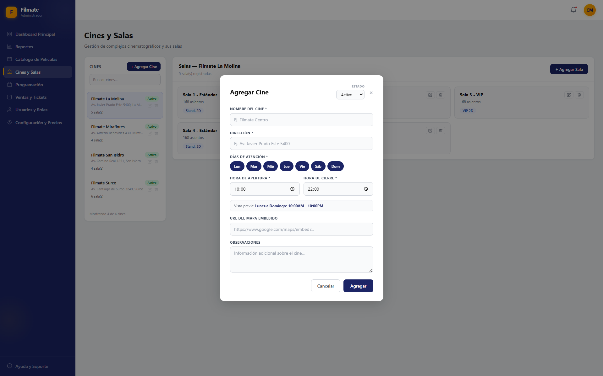

*Figura 8. Formulario para agregar un nuevo cine.*

Elementos y lectura de la pantalla:

- Todos los campos obligatorios están marcados.
- El teléfono debe tener formato válido.
- El estado permite activar o desactivar el cine.

## 8.3 Agregar una sala

1. Seleccione un cine del listado y acceda a sus salas.
2. Seleccione «Agregar Sala».
3. Complete nombre de sala, tipo y capacidad de asientos.
4. Guarde y verifique que la sala aparezca en el listado del cine.

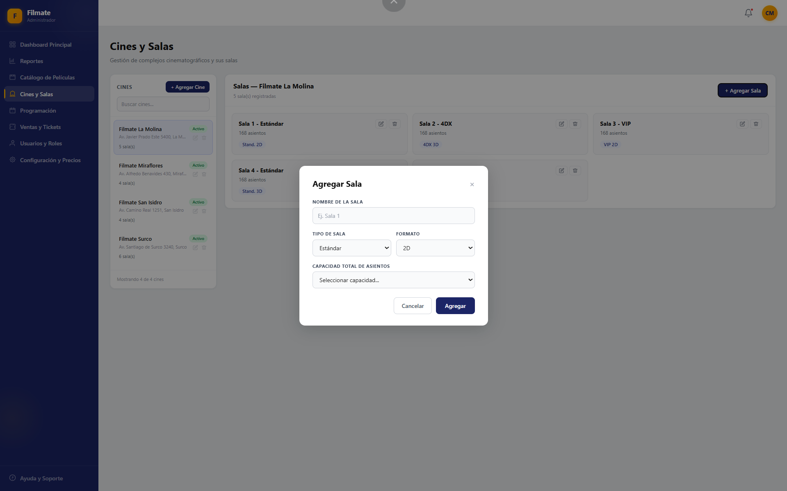

*Figura 9. Formulario de registro de nueva sala.*

Elementos y lectura de la pantalla:

- El nombre debe ser único dentro del mismo cine.
- El tipo de sala puede ser 2D, 3D o VIP.
- La capacidad define el número de asientos disponibles.

## 8.4 Editar una sala

1. Localice la sala en el listado del cine correspondiente.
2. Seleccione el icono de edición.
3. Modifique los campos necesarios: nombre, tipo, capacidad.
4. Guarde los cambios y verifique la actualización.

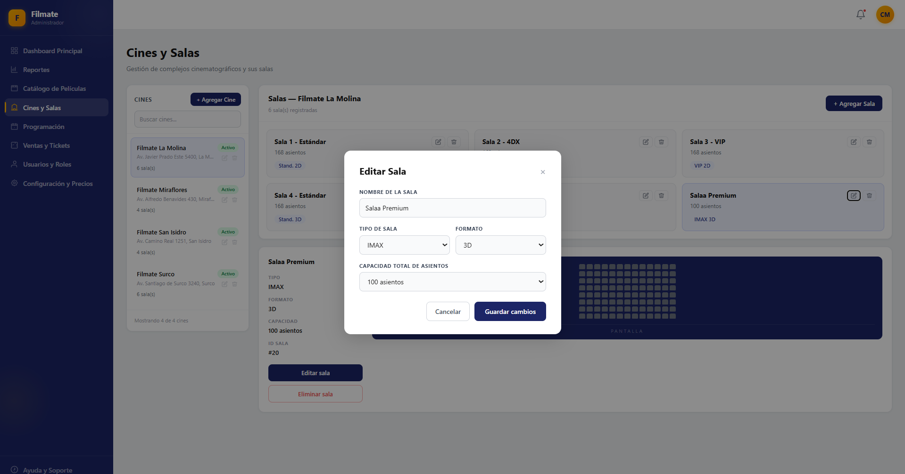

*Figura 10. Formulario de edición de sala con datos precargados.*

Elementos y lectura de la pantalla:

- Los campos se cargan con la información actual de la sala.
- Es posible cambiar el tipo o capacidad según necesidad.
- La actualización no afecta funciones futuras ya programadas.

## 8.5 Eliminar una sala

Precondición: la sala no debe tener funciones activas programadas.

1. Localice la sala en el listado del cine.
2. Seleccione el icono de eliminación.
3. Confirme la acción en el diálogo emergente.
4. Verifique que la sala desaparezca del listado.

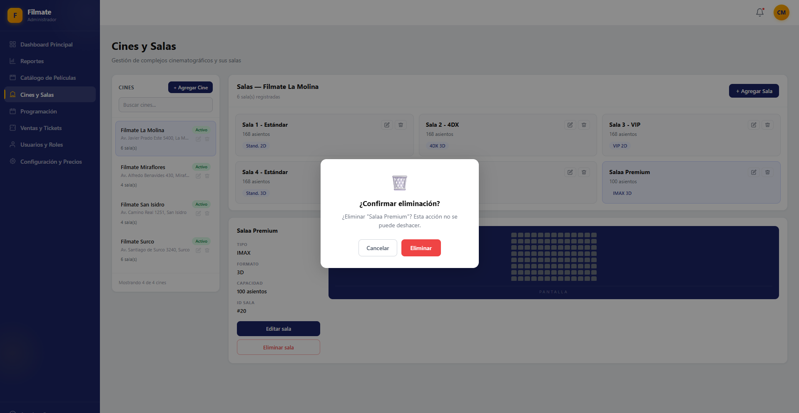

*Figura 11. Diálogo de confirmación para eliminar una sala.*

Elementos y lectura de la pantalla:

- El sistema solicita confirmación antes de eliminar.
- Si la sala tiene funciones activas, se mostrará una advertencia.
- La eliminación es permanente y no se puede deshacer.

# 9. Programación

## 9.1 Vista general de programación

El módulo de Programación permite asignar películas a salas con horarios específicos.

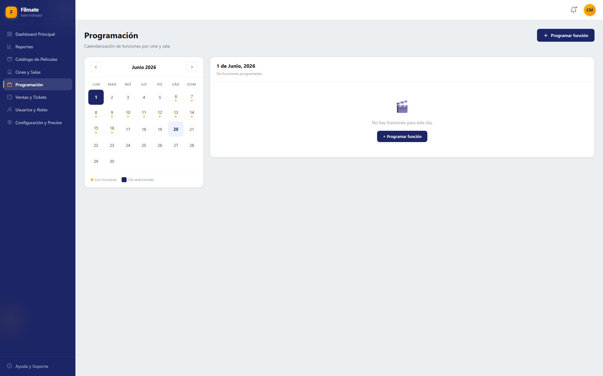

*Figura 12. Vista general de la programación de funciones.*

Elementos y lectura de la pantalla:

- Listado de funciones programadas con película, cine, sala, fecha y hora.
- Botones para agregar, editar y eliminar funciones.
- Filtros por cine, película o fecha para localizar funciones.

## 9.2 Elegir fecha y filtros

1. Use el selector de fecha para visualizar funciones de un día específico.
2. Filtre por cine o película para reducir los resultados.
3. Seleccione una fecha futura para planificar nueva programación.

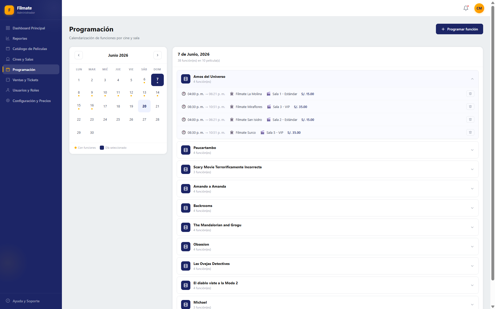

*Figura 13. Selector de fecha para filtrar la programación.*

Elementos y lectura de la pantalla:

- El calendario permite navegar entre meses.
- Las fechas con funciones se muestran con un indicador visual.
- Seleccione cualquier fecha para ver su programación.

## 9.3 Visualizar y gestionar funciones

1. Revise las funciones listadas para la fecha seleccionada.
2. Cada función muestra película, sala, hora de inicio y precio.
3. Use «Agregar Función» para crear un nuevo horario.
4. Edite o elimine funciones según sea necesario.

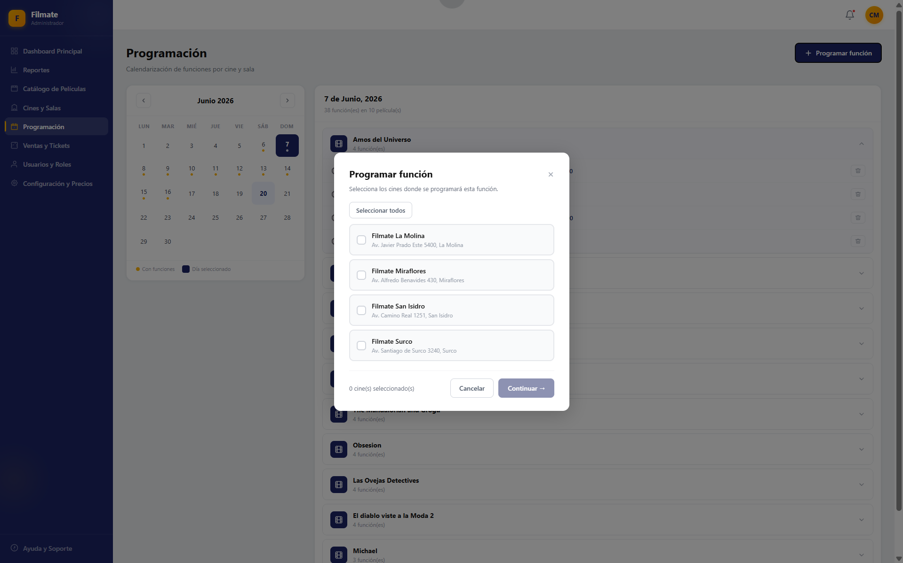

*Figura 14. Funciones programadas para una fecha específica.*

Elementos y lectura de la pantalla:

- Las funciones se agrupan por cine y sala.
- El precio base de la función se muestra en la lista.
- Evite superponer funciones en la misma sala y horario.

# 10. Ventas y tickets

## 10.1 Vista general de ventas

El módulo de Ventas y Tickets lista todas las transacciones realizadas a través de la plataforma.

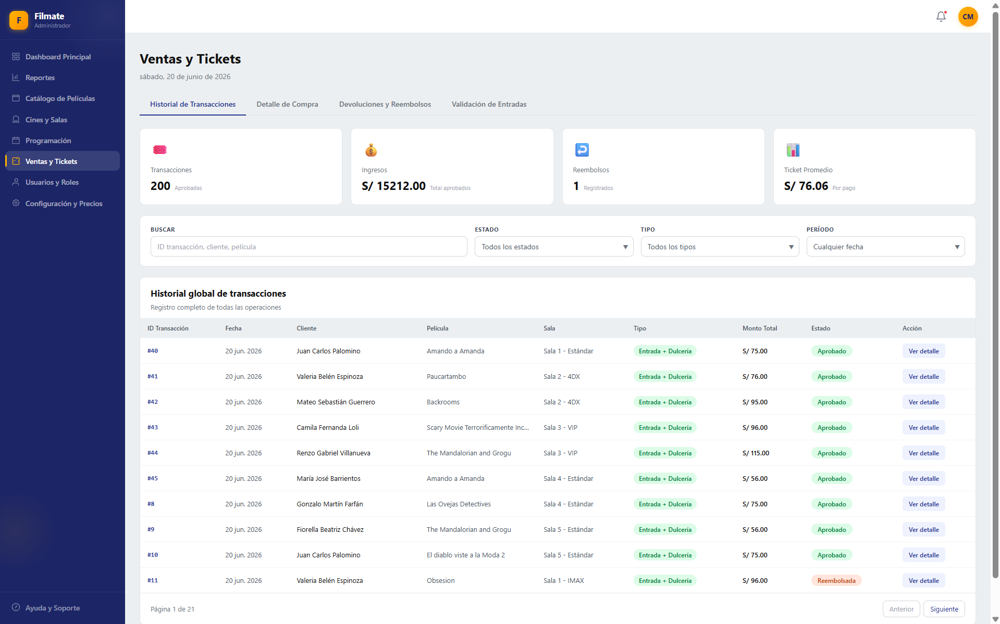

*Figura 15. Listado general de ventas y tickets.*

Elementos y lectura de la pantalla:

- Cada fila representa una transacción con ID, usuario, película y monto.
- El estado indica si la venta está activa, reembolsada o en proceso.
- Botones de acción: ver detalle y procesar reembolso.

## 10.2 Filtros de búsqueda

1. Filtre por rango de fechas para acotar los resultados.
2. Busque por ID de transacción o nombre de usuario.
3. Filtre por estado: activa, reembolsada o en proceso.
4. Seleccione «Limpiar filtros» para restablecer la vista completa.

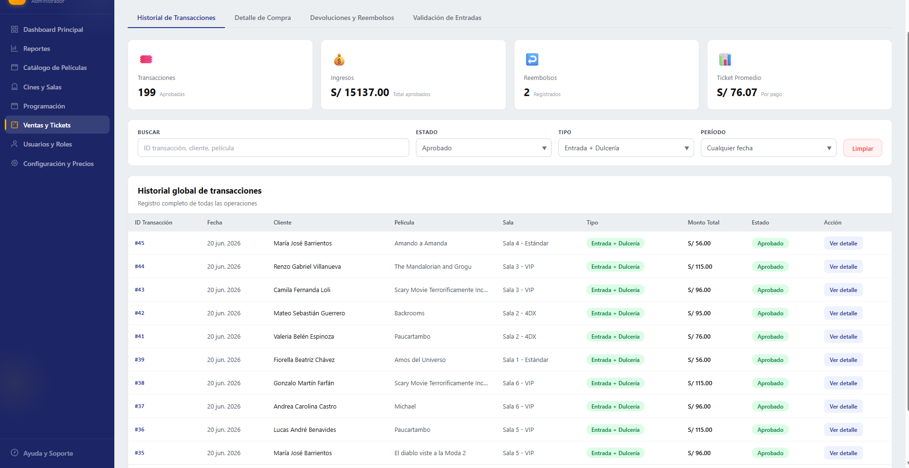

*Figura 16. Ventas filtradas por criterios de búsqueda.*

Elementos y lectura de la pantalla:

- Los filtros se aplican en el servidor para optimizar la búsqueda.
- Combine fecha, usuario y estado para localizar una transacción específica.
- El resultado muestra solo las transacciones que cumplen todos los criterios.

## 10.3 Detalle de ticket

Al seleccionar una transacción, se muestra el detalle completo del ticket, incluyendo película, cine, sala, fecha, asientos, productos de dulcería y método de pago.

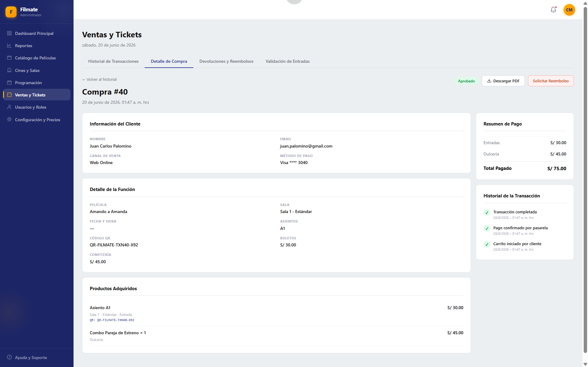

*Figura 17. Detalle completo de un ticket de venta.*

Elementos y lectura de la pantalla:

- Información de la función: película, cine, sala, fecha y hora.
- Listado de asientos adquiridos con fila y número.
- Productos de dulcería incluidos en la compra.
- Método de pago, monto total y estado de la transacción.

# 11. Reembolsos y devoluciones

## 11.1 Solicitar reembolso

El administrador puede iniciar un proceso de reembolso desde el detalle del ticket.

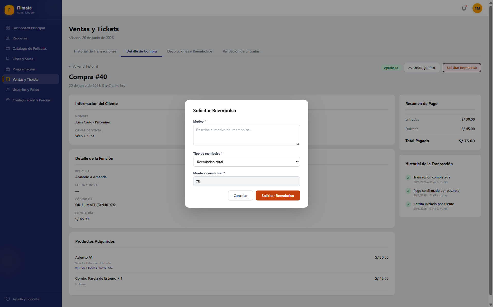

*Figura 18. Formulario de solicitud de reembolso.*

Elementos y lectura de la pantalla:

- Seleccione el motivo del reembolso de la lista predefinida.
- Agregue un comentario opcional para justificar la solicitud.
- Confirme la solicitud para iniciar el proceso.

## 11.2 Devoluciones y reembolsos

El sistema mantiene un registro de todas las solicitudes de reembolso con su estado actual.

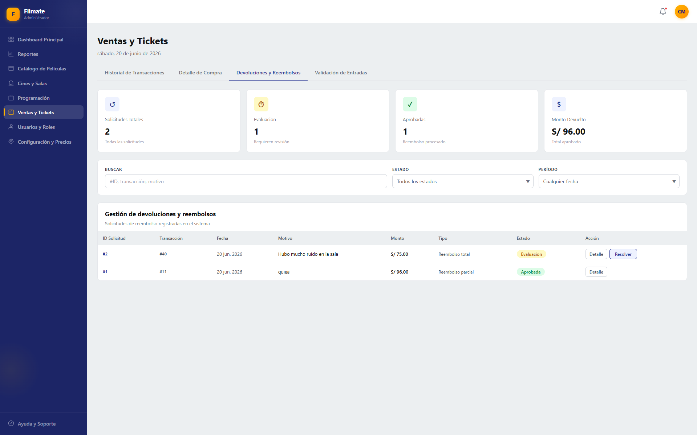

*Figura 19. Listado de devoluciones y reembolsos.*

Elementos y lectura de la pantalla:

- Cada solicitud muestra ID, usuario, monto, motivo y estado.
- Estados: pendiente, aprobado, rechazado.
- Seleccione una solicitud para ver su detalle o resolverla.

## 11.3 Ver detalle de solicitud de reembolso

1. Localice la solicitud en el listado de reembolsos.
2. Seleccione la solicitud para ver su detalle completo.
3. Revise la información del ticket original y el motivo indicado.

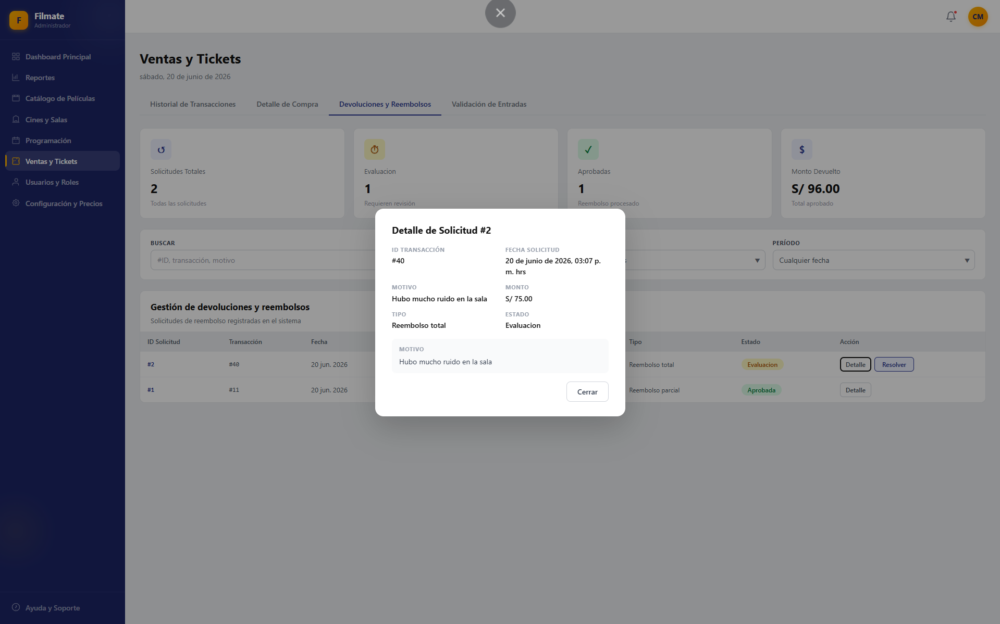

*Figura 20. Detalle completo de una solicitud de reembolso.*

Elementos y lectura de la pantalla:

- Muestra el ticket original asociado a la solicitud.
- Incluye el motivo y comentario del solicitante.
- Botones para aprobar o rechazar la solicitud.

## 11.4 Resolver una solicitud de reembolso

1. Acceda al detalle de la solicitud pendiente.
2. Revise la información y el motivo presentado.
3. Seleccione «Aprobar» o «Rechazar» según corresponda.
4. Agregue un comentario sobre la resolución si es necesario.
5. Confirme la acción para actualizar el estado de la solicitud.

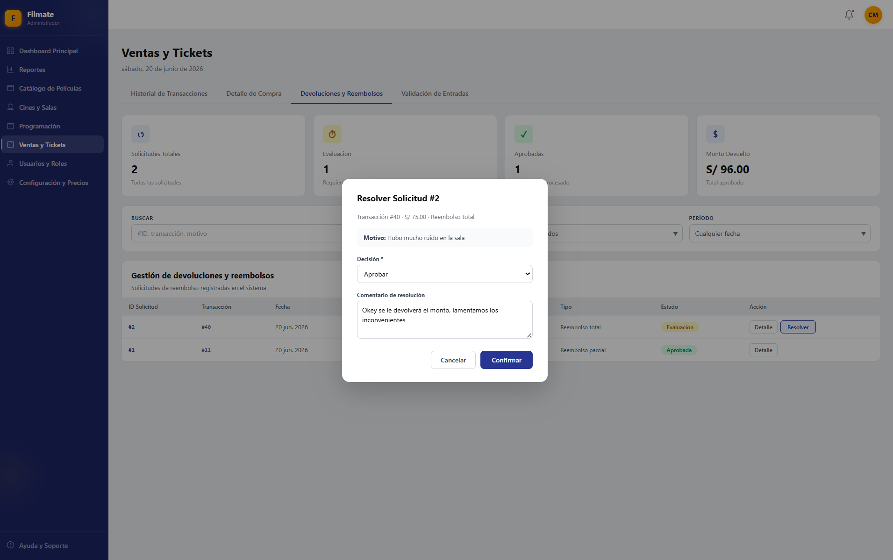

*Figura 21. Resolución de una solicitud de reembolso.*

Elementos y lectura de la pantalla:

- El administrador puede aprobar o rechazar la solicitud.
- Al aprobar, el sistema procesa la devolución del monto.
- El ticket original se marca como reembolsado.

## 11.5 Solicitud resuelta

Una vez procesada, la solicitud cambia su estado a aprobado o rechazado y se registra la fecha de resolución.

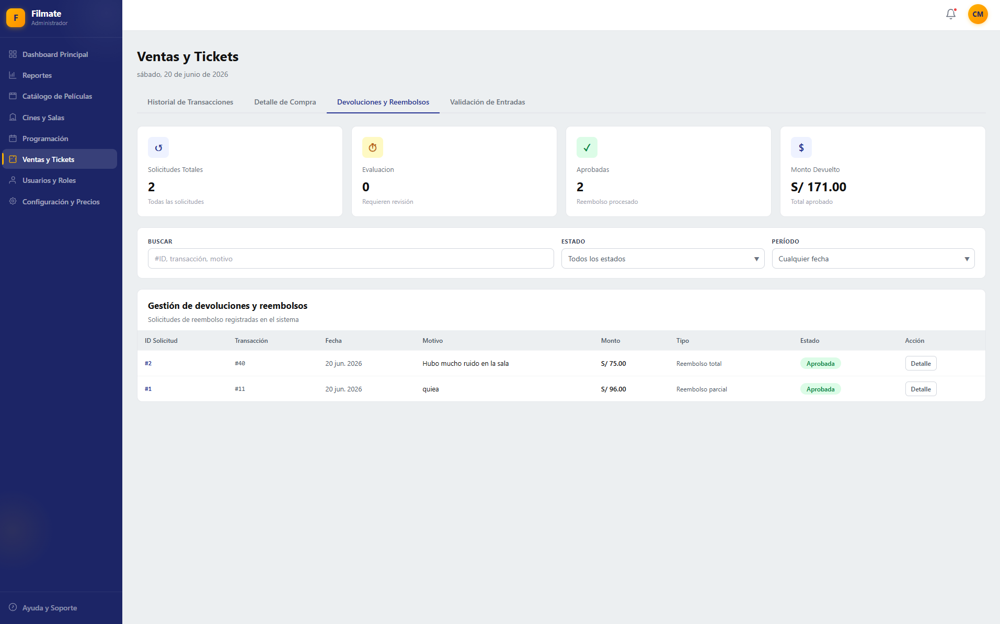

*Figura 22. Solicitud de reembolso resuelta exitosamente.*

Elementos y lectura de la pantalla:

- El estado refleja la decisión del administrador.
- La fecha de resolución queda registrada en el sistema.
- El ticket asociado se actualiza según corresponda.

## 11.6 Ver detalle de solicitud resuelta

1. Acceda al listado de reembolsos y localice la solicitud resuelta.
2. Seleccione la solicitud para ver su detalle.
3. Revise el estado final, comentarios y fecha de resolución.

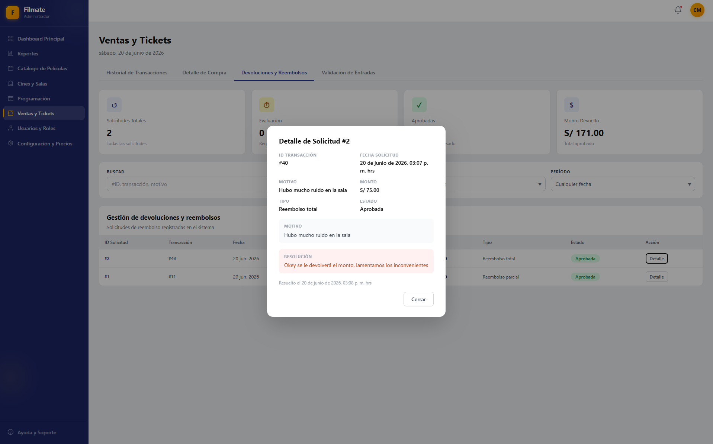

*Figura 23. Detalle de una solicitud de reembolso ya resuelta.*

Elementos y lectura de la pantalla:

- Muestra el estado final: aprobado o rechazado.
- Incluye la fecha y comentario de resolución.
- El ticket original refleja el cambio de estado.

# 12. Validación de entrada

## 12.1 Escanear ticket

El módulo de Validación permite escanear el código QR del ticket para verificar su autenticidad y permitir el ingreso a la sala.

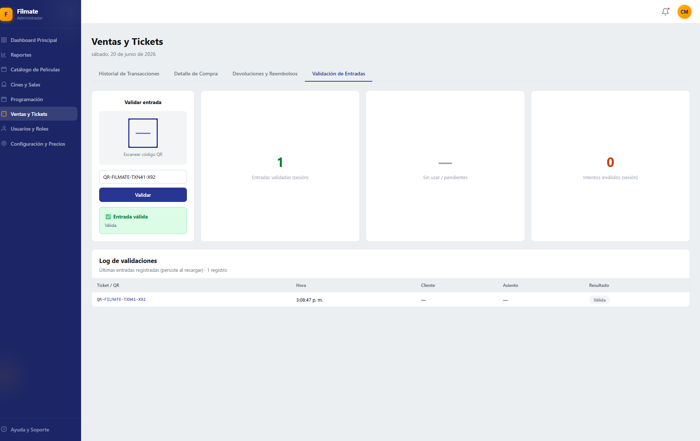

*Figura 24. Pantalla de validación de entrada con escaneo de QR.*

Elementos y lectura de la pantalla:

- Active la cámara para escanear el código QR del ticket.
- El sistema muestra la información de la función al detectar un ticket válido.
- Indicador visual del estado: válido, usado o inválido.

## 12.2 Validación de entrada doble

Para grupos o compras múltiples, el sistema permite validar varias entradas de una misma transacción de forma secuencial.

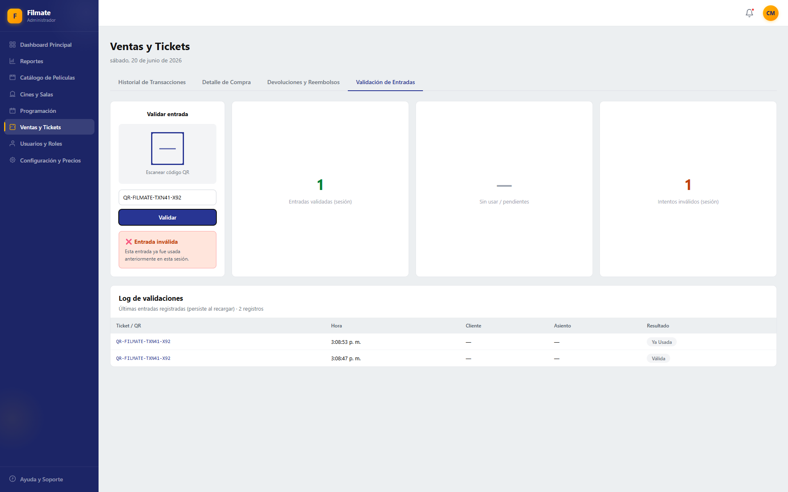

*Figura 25. Validación de múltiples entradas de una misma transacción.*

Elementos y lectura de la pantalla:

- El sistema muestra las entradas restantes por validar.
- Cada validación registra la hora de ingreso.
- Una vez validadas todas, la transacción se marca como completa.

# 13. Ayuda y soporte

## 13.1 Gestión de consultas

El módulo de Ayuda y Soporte permite al administrador gestionar las consultas enviadas por los usuarios desde el frontend público.

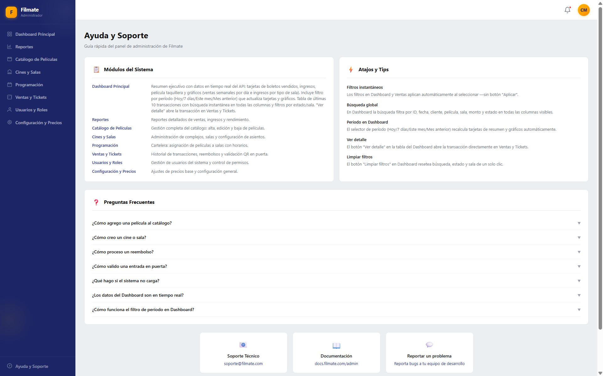

*Figura 26. Panel de gestión de consultas de ayuda y soporte.*

Elementos y lectura de la pantalla:

- Listado de consultas recibidas con asunto, usuario y fecha.
- Estado de cada consulta: pendiente, en proceso, resuelto.
- Seleccione una consulta para ver el detalle y responder.
- Historial de respuestas asociadas a cada consulta.

## 13.2 Responder una consulta

1. Seleccione la consulta del listado para abrir el detalle.
2. Revise el mensaje del usuario y la información asociada.
3. Redacte una respuesta en el campo de texto.
4. Seleccione «Enviar respuesta» para notificar al usuario.
5. Actualice el estado de la consulta según corresponda.

# 14. Solución de problemas

| Problema | Causa probable | Solución del administrador |
|---|---|---|
| No cargan estadísticas | Backend no disponible o red interrumpida. | Comprobar conexión, esperar y recargar la página. |
| No aparecen películas | Catálogo vacío o filtros restrictivos. | Verificar el catálogo y limpiar filtros. |
| No se puede agregar cine | Campos obligatorios incompletos. | Completar todos los campos requeridos. |
| Error al eliminar sala | La sala tiene funciones activas. | Revisar y eliminar las funciones primero. |
| No se puede crear función | Superposición de horarios en la misma sala. | Elegir un horario disponible. |
| Solicitud de reembolso no aparece | Filtros de estado activos. | Limpiar filtros y verificar el listado completo. |
| Validación de QR falla | Ticket ya usado, vencido o código inválido. | Verificar manualmente el ID de transacción. |
| No se envían respuestas de soporte | Error de API o red. | Reintentar y verificar el estado del servicio. |

## 14.1 Qué hacer ante un pago incierto

1. Verifique el estado de la transacción en Ventas y Tickets.
2. Consulte el detalle del ticket para confirmar el monto.
3. Si el cliente reporta un cobro sin ticket, revise el historial de transacciones.
4. Contacte al área de TI si persisten las discrepancias.

# 15. Seguridad, privacidad y buenas prácticas

- Use una contraseña exclusiva y no la comparta.
- Compruebe la URL antes de ingresar credenciales.
- Cierre sesión en equipos compartidos o públicos.
- No comparta información de tickets, transacciones o datos personales de usuarios.
- Revise las solicitudes de reembolso antes de aprobarlas.
- Evite actualizar o retroceder mientras se procesa una operación crítica.
- Mantenga el navegador actualizado.
- Reporte actividades sospechosas o accesos no autorizados.

# 16. Criterios de aceptación del administrador

| ID | Criterio verificable | Evidencia |
|---|---|---|
| CA-01 | El administrador puede iniciar sesión con credenciales válidas. | Figura 1 |
| CA-02 | La barra lateral permite navegar entre todos los módulos. | Figura 2 |
| CA-03 | El dashboard muestra estadísticas y gráficos filtrables por período. | Figuras 3 y 4 |
| CA-04 | El catálogo lista y filtra películas. | Figuras 5 y 6 |
| CA-05 | El administrador puede gestionar cines y salas (CRUD). | Figuras 7 a 11 |
| CA-06 | La programación permite crear y visualizar funciones por fecha. | Figuras 12, 13 y 14 |
| CA-07 | Las ventas se listan con filtros y detalle de ticket. | Figuras 15, 16 y 17 |
| CA-08 | El administrador puede gestionar el flujo completo de reembolsos. | Figuras 18 a 23 |
| CA-09 | La validación de entrada permite escanear y verificar tickets. | Figuras 24 y 25 |
| CA-10 | El módulo de ayuda permite gestionar consultas de usuarios. | Figura 26 |

# 17. Gestión de configuración del manual

Para el curso de Gestión de la Configuración de Software, este manual se considera un elemento de configuración documental relacionado con el frontend administrativo.

## 17.1 Elementos bajo control

| Elemento | Identificador / ubicación | Disparador de actualización |
|---|---|---|
| Manual editable | docs-manual-admin/Manual_de_Administrador_FILMATE.docx | Cambio funcional o corrección aprobada. |
| Manual portable | docs-manual-admin/Manual_de_Administrador_FILMATE.pdf | Nueva versión del manual editable. |
| Fuente trazable | docs-manual-admin/Manual_de_Administrador_FILMATE.md | Cambio de contenido o estructura. |
| Evidencias | docs-manual-admin/capturas/*.png | Cambio visual, etiqueta, ruta o resultado. |
| Automatización | scripts/manual/generate_admin_manual.py | Cambio de contenido o estructura del manual. |

## 17.2 Procedimiento de cambio

1. Registrar la solicitud de cambio y el motivo.
2. Identificar requisitos, pantallas y procedimientos afectados.
3. Actualizar la aplicación o el contrato API correspondiente.
4. Ejecutar nuevamente las capturas afectadas.
5. Actualizar contenido, control de versiones y matriz de trazabilidad.
6. Revisar ortografía, consistencia, enlaces e imágenes.
7. Generar Word y PDF desde la fuente.
8. Aprobar y etiquetar la nueva línea base documental.

## 17.3 Nomenclatura de versiones

Se recomienda usar versión mayor cuando cambia el flujo o alcance del manual; versión menor cuando se agregan funciones compatibles; y revisión de parche cuando solo se corrigen redacción, formato o capturas sin cambiar el procedimiento.

# 18. Glosario

| Término | Definición |
|---|---|
| API | Servicio que comunica el frontend con datos y operaciones del sistema. |
| Dashboard | Panel principal con métricas y gráficos del negocio. |
| CRUD | Crear, Leer, Actualizar, Eliminar: operaciones básicas de gestión. |
| Función | Exhibición de una película en fecha, hora, cine y sala determinados. |
| Sala | Espacio físico donde se exhiben películas. |
| Reembolso | Devolución del monto pagado por un ticket. |
| QR | Código gráfico asociado al ticket para validación de entrada. |
| Ticket | Comprobante de compra con información de la función y asientos. |
| Línea base | Versión aprobada y controlada de software, datos o documentación. |
| Elemento de configuración | Activo sujeto a identificación, versión, cambio y auditoría. |

# 19. Guía rápida

> Gestionar películas: Catálogo → Agregar / Editar / Eliminar película.

> Programar función: Programación → Seleccionar fecha → Agregar función → Elegir película, sala y horario.

> Procesar reembolso: Ventas → Ticket → Solicitar reembolso → Revisar → Aprobar o rechazar.

> Validar entrada: Validación de Entrada → Escanear QR → Verificar → Confirmar ingreso.
